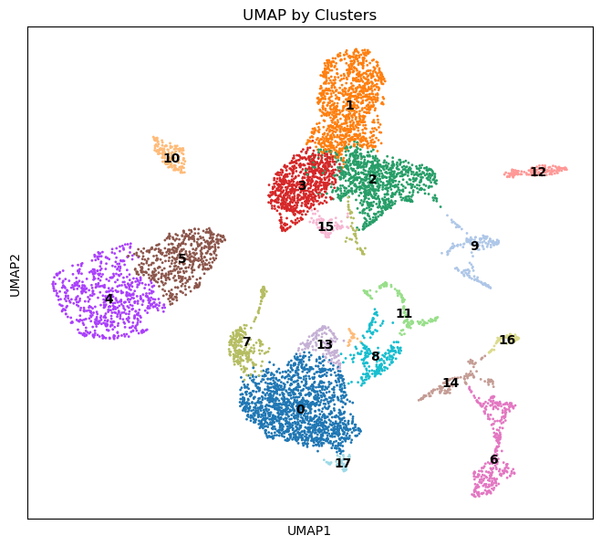
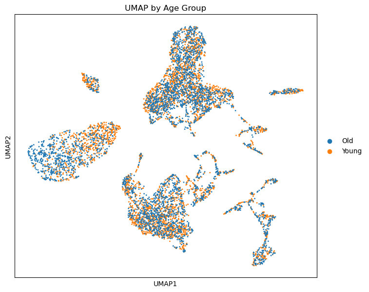
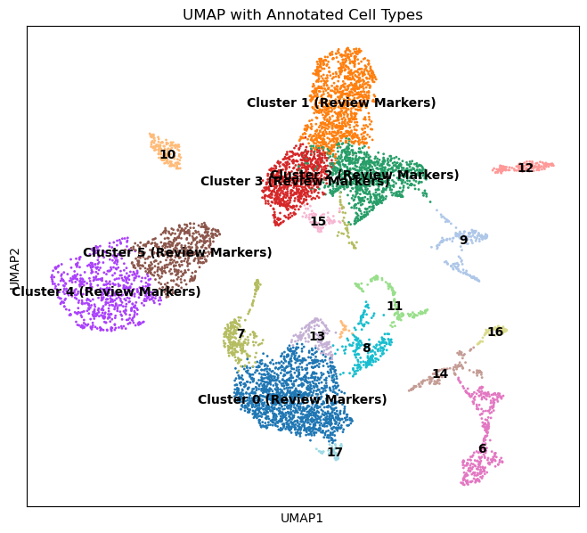

# 🔬 Single-Cell RNA-seq Analysis: Cellular Aging in Mouse Skeletal Muscle

## Project Overview

This repository presents a robust and fully reproducible bioinformatics pipeline for the analysis of single-cell RNA sequencing (scRNA-seq) data. The project specifically investigates **age-related cellular changes within mouse skeletal muscle**, leveraging publicly available data from NCBI GEO (GSE172410).

From raw gene count matrices to integrated data, clustering, and initial visualizations, this pipeline demonstrates a comprehensive workflow for complex single-cell transcriptomics studies.

---

## 🛠️ Skills & Technologies Showcased

This project highlights expertise in:

* **Reproducible Research:** Building automated workflows with [Snakemake](https://snakemake.readthedocs.io/).
* **Single-Cell Data Analysis:** Comprehensive processing, quality control, integration, dimensionality reduction (PCA, UMAP), and clustering using [Scanpy](https://scanpy.readthedocs.io/) and its ecosystem.
* **Batch Correction:** Implementing advanced techniques like Harmony integration with [harmonypy](https://github.com/lilab-broad/harmonypy).
* **Cloud Computing:** Efficient execution and data management on [Google Colab](https://colab.research.google.com/) with Google Drive integration.
* **Python Programming:** Scripting and data manipulation with `pandas`, `numpy`, and `matplotlib`.
* **Environment Management:** Utilizing [Conda](https://docs.conda.io/) for isolated and consistent software environments.

---

## 📊 Preliminary Results & Visualizations

Here's a glimpse into the cellular landscape of young and old mouse muscle:

### **1. UMAP Projection by Cell Clusters**
A global view of the identified cell populations within the muscle microenvironment.

### **2. UMAP Projection by Age Group**
Visualizing the distribution of cells from young (6 months) and old (24 months) mice after batch correction.

### **3. Annotated Cell Types (Initial)**
Preliminary annotation of cell clusters based on key marker genes. (This will be further refined with biological insights.)

---

## 🚀 Reproducibility

The entire analysis workflow, from processed data input to final results, is encapsulated within a Snakemake pipeline, ensuring full reproducibility.

* **Data Source:** The raw data (GSE172410) is publicly available on [NCBI GEO](https://www.ncbi.nlm.nih.gov/geo/query/acc.cgi?acc=GSE172410). The processed input files for this pipeline are derived from this dataset.
* **Interactive Notebook:** A [Google Colab notebook](https://colab.research.google.com/github/[YourGitHubUsername]/[your-repo-name]/blob/main/analysis_workflow.ipynb) is provided within this repository, demonstrating how to execute the full pipeline step-by-step in a cloud environment.

---

## 📬 Contact

I'm always open to discussing bioinformatics, single-cell analysis, and collaborative projects!

**Email:** [akshat.bio@proton.me](mailto:akshat.bio@proton.me)
**LinkedIn:** [Akshat Jaiswal](https://www.linkedin.com/in/akshat-jaiswal-b06a93195/)

---
